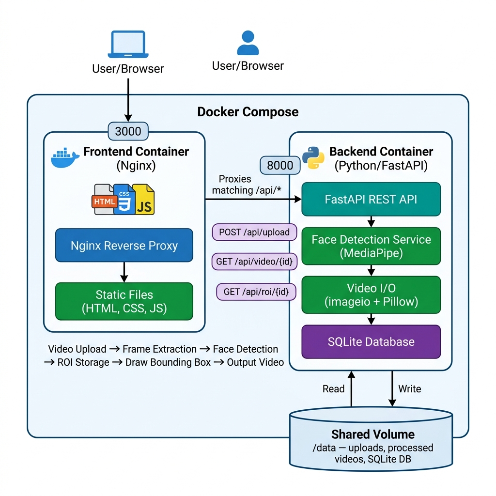

# FaceROI — AI Face Detection & ROI Video Processing System

A containerized system that accepts a video, detects faces using **OpenCV Haar Cascade**, draws axis-aligned bounding boxes (ROI) on each frame using **Pillow** (not OpenCV), stores ROI data per-frame in **SQLite**, and serves the processed video and ROI data via a REST API backed by a modern frontend dashboard.

---

## Architecture



### Components

| Component | Technology | Purpose |
|-----------|-----------|---------|
| **Backend API** | FastAPI (Python 3.11) | REST API — upload, serve video & ROI data |
| **Face Detection** | OpenCV Haar Cascade | Lightweight CPU-only frontal face detection |
| **ROI Drawing** | Pillow (`PIL.ImageDraw`) | Draws bounding boxes on frames — **no OpenCV drawing** |
| **Video I/O** | OpenCV (`VideoCapture` / `VideoWriter`) | Frame-by-frame streaming read/write |
| **Database** | SQLite | Stores per-frame bounding-box coordinates |
| **Frontend** | HTML / CSS / JS + Nginx | Upload dashboard and annotated video viewer |
| **Containerization** | Docker + Docker Compose | Two-container deployment (frontend + backend) |

---

## Quick Start

### Prerequisites
- [Docker](https://docs.docker.com/get-docker/) & Docker Compose installed

### Run

```bash
# Enter the project directory
cd assignment

# Build and start both containers
docker compose up --build
```

| Service | URL |
|---------|-----|
| **Frontend** | http://localhost:3000 |
| **Backend API** | http://localhost:8000 |
| **Swagger Docs** | http://localhost:8000/docs |

### Stop

```bash
docker compose down
```

### Stop and remove persisted data

```bash
docker compose down -v
```

---

## API Endpoints

### `POST /api/upload` — Upload a Video

```bash
curl -X POST http://localhost:8000/api/upload \
  -F "file=@my_video.mp4"
```

**Response:**
```json
{
  "video_id": 1,
  "status": "done",
  "total_frames": 150,
  "frames_with_face": 142,
  "fps": 30.0,
  "resolution": "1920x1080"
}
```

### `GET /api/video/{video_id}` — Download Processed Video

```bash
curl http://localhost:8000/api/video/1 --output processed.mp4
```

Returns the annotated `.mp4` with green bounding boxes drawn on detected faces.

### `GET /api/roi/{video_id}` — Per-Frame ROI Data

```bash
curl http://localhost:8000/api/roi/1
```

**Response:**
```json
{
  "video_id": 1,
  "total_frames": 150,
  "fps": 30.0,
  "resolution": "1920x1080",
  "roi_data": [
    {
      "frame_number": 0,
      "face_detected": true,
      "bounding_box": {
        "x_min": 423,
        "y_min": 156,
        "x_max": 612,
        "y_max": 398,
        "width": 189,
        "height": 242
      },
      "confidence": 1.0
    }
  ]
}
```

### `GET /api/videos` — List All Videos

```bash
curl http://localhost:8000/api/videos
```

---

## Database Schema

**SQLite** was chosen because:
- The data is relational and structured (videos → per-frame ROI rows)
- No separate database server is needed — fits the single-container backend
- Perfectly sized for per-frame bounding-box coordinate storage

```sql
-- Tracks each uploaded video and its processing state
CREATE TABLE videos (
    id                 INTEGER PRIMARY KEY AUTOINCREMENT,
    filename           TEXT NOT NULL,
    original_filename  TEXT NOT NULL,
    processed_filename TEXT,
    status             TEXT DEFAULT 'pending',  -- pending | processing | done | error
    total_frames       INTEGER,
    fps                REAL,
    width              INTEGER,
    height             INTEGER,
    created_at         DATETIME DEFAULT CURRENT_TIMESTAMP
);

-- One row per frame — stores the face bounding-box coordinates
CREATE TABLE roi_data (
    id            INTEGER PRIMARY KEY AUTOINCREMENT,
    video_id      INTEGER REFERENCES videos(id),
    frame_number  INTEGER NOT NULL,
    face_detected BOOLEAN DEFAULT FALSE,
    x_min         INTEGER,
    y_min         INTEGER,
    x_max         INTEGER,
    y_max         INTEGER,
    width         INTEGER,
    height        INTEGER,
    confidence    REAL
);
```

---

## ROI Drawing — No OpenCV Drawing APIs Used

The requirement is to draw ROI boxes **without using OpenCV's drawing functions**.
All annotation is done exclusively with **Pillow**:

| Task | Library |
|------|---------|
| Face detection | `cv2.CascadeClassifier` (Haar Cascade) |
| **Drawing ROI rectangle** | **`PIL.ImageDraw.rectangle()`** |
| **Drawing confidence label** | **`PIL.ImageDraw.text()`** |
| Video read | `cv2.VideoCapture` |
| Video write | `cv2.VideoWriter` |
| Array ops | NumPy |

`cv2.rectangle`, `cv2.putText`, and all other OpenCV drawing APIs are **not used**.

---

## Processing Pipeline

```
Video Upload (POST /api/upload)
        │
        ▼
Save to /data/uploads/
        │
        ▼
cv2.VideoCapture  ──── read frame-by-frame ────▶
        │
        ▼
Haar Cascade face detection (per frame)
        │
        ├── face found ──▶ Pillow draws ROI bounding box
        │                        │
        └── no face    ──▶ frame passed through unchanged
                                 │
        ┌────────────────────────┘
        ▼
Store ROI coords in SQLite (roi_data table)
        │
        ▼
cv2.VideoWriter  ──── write annotated frame ────▶ /data/processed/
        │
        ▼
GET /api/video/{id}   ──── serve annotated video
GET /api/roi/{id}     ──── serve per-frame ROI JSON
```

---

## Project Structure

```
assignment/
├── docker-compose.yml          # Orchestrates frontend + backend containers
├── architecture_diagram.png    # System architecture diagram
├── README.md
├── .gitignore
├── backend/
│   ├── Dockerfile              # python:3.11-slim + opencv-python-headless
│   ├── requirements.txt
│   └── app/
│       ├── __init__.py
│       ├── main.py             # FastAPI app — 4 REST endpoints
│       ├── database.py         # SQLite schema & async connection
│       └── face_detector.py    # Haar Cascade detection + Pillow ROI drawing
└── frontend/
    ├── Dockerfile              # nginx:alpine serving static files
    ├── nginx.conf              # Reverse proxy → backend:8000
    ├── index.html              # Dashboard UI
    ├── style.css               # Dark theme styles
    └── app.js                  # Upload, polling & video visualization
```

---

## Why `opencv-python-headless`?

The `headless` variant of OpenCV is used intentionally:

| Package | `libgl1` | `libglib2.0-0` | ffmpeg system dep | Size |
|---------|----------|----------------|-------------------|------|
| `mediapipe` + `imageio-ffmpeg` | ✅ Required | ✅ Required | ✅ Required | ~350 MB |
| `opencv-python-headless` | ❌ Not needed | ❌ Not needed | ❌ Not needed | ~50 MB |

The headless build strips all GUI/display dependencies, making it ideal for server/container environments.
